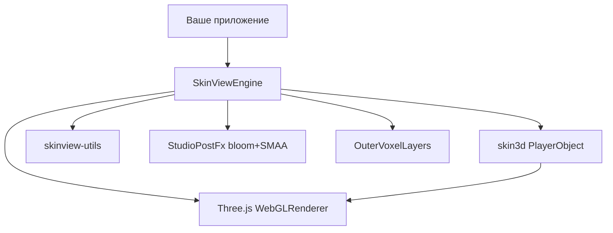

# Архитектура

## Стек



| Слой | Роль |
|------|------|
| **skin3d** | Модель персонажа, UV-атлас скина, cape/elytra, базовые анимации |
| **skinview-utils** | `loadSkinToCanvas`, `inferModelType`, загрузка изображений |
| **Three.js** | Сцена, камера, свет, тени, OrbitControls, postprocessing |
| **Mine3D Embedded** | Студийная сцена, outer voxels, анимации продукта, кадрирование, debug |

## Кадр

1. Обновление OrbitControls / auto-rotate
2. Сэмпл анимации (+ кроссфейд)
3. Cursor-look (idle)
4. Частицы / dress FX
5. Рендер: EffectComposer **или** прямой `renderer.render`

## Outer voxels

Второй слой скина (hat/jacket) может собираться в 3D-воксели (`OuterVoxelLayers`) вместо плоского overlay — визуально ближе к «3D Skin Layers». Плоский outer при этом синхронизируется по видимости, чтобы не было двойного слоя.

Флаг debug `outerVoxels` включает/выключает воксельный слой.

## PostFX

`StudioPostFx`: RenderPass → UnrealBloomPass → SMAAPass → OutputPass.

MSAA на render target с `NearestFilter` текстурой скина даёт кайму по UV, поэтому сглаживание силуэта делается SMAA в экранном пространстве.

Render target использует `UnsignedByteType` для стабильности в браузерном ANGLE/WebGL2.

## Освещение и атмосфера

- Key / fill / ambient directional + ambient
- Contact shadow под ногами
- Диск пола + ground plane
- Градиентный фон `StudioAtmosphere`
- Опциональный envMap на материалах скина

## Ограничения

- Только WebGL (не Vulkan/WebGPU напрямую). В Electron/Chrome возможен ANGLE→D3D/Vulkan под капотом драйвера.
- Один движок ≈ один WebGL-контекст. Много одновременных инстансов дорого.
- Remote-скины требуют CORS.
- Версия `three` должна совпадать с peer (`^0.156.1`).

## Структура исходников

```
src/
  index.ts              — публичный API
  types.ts              — EngineOptions, debug types
  core/
    scene-loop.ts       — SkinViewEngine
    skin-animations.ts  — клипы и shot presets
    skin-username.ts    — CDN по нику
    skin-image.ts       — загрузка PNG
    skin-texture.ts     — CanvasTexture
    skin-outer-voxel.ts — 3D outer
    skin-uv-inset.ts
    product-visuals.ts  — свет, материалы
    studio-atmosphere.ts
    studio-postfx.ts
    camera-framing.ts
    pixel-particles.ts
    skin-leg-stock.ts
```
